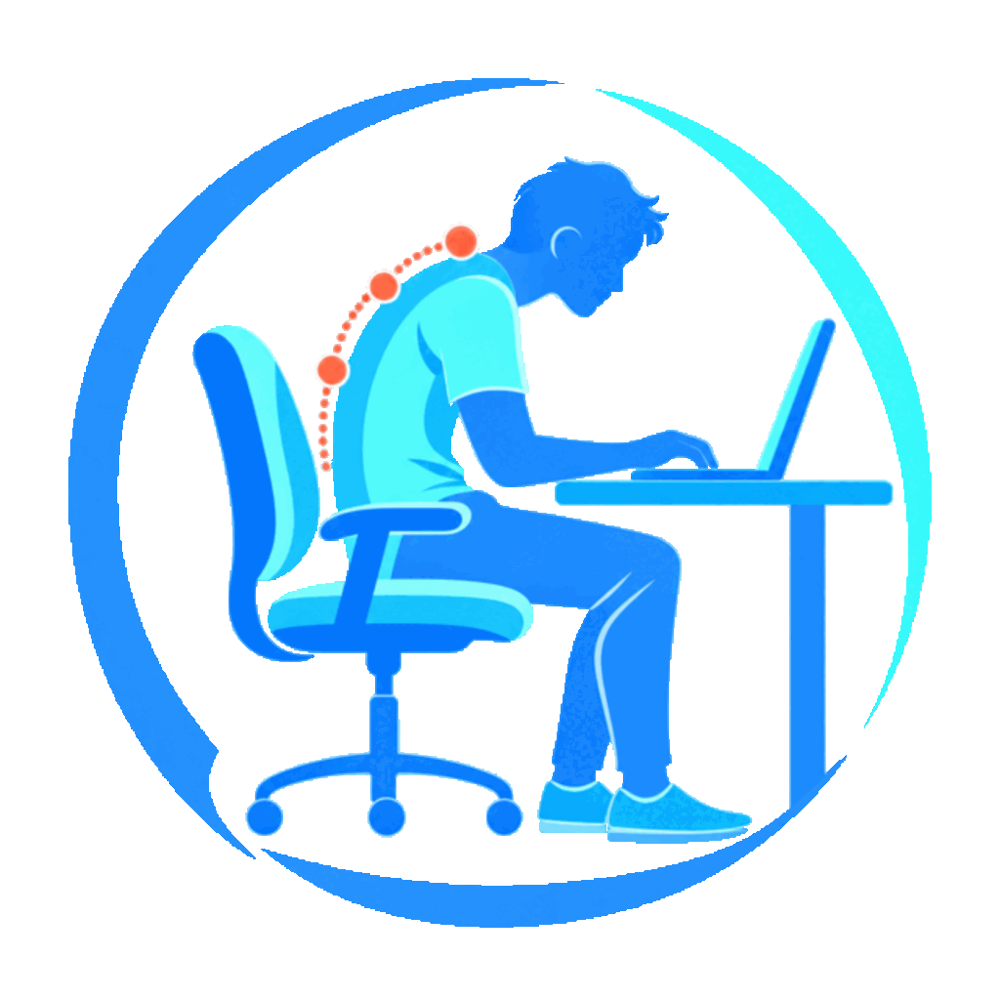

<p align="center">
  
</p>

# Slouch No More

macOS menu bar app that watches your webcam and nags you when you slouch.
Everything runs locally — no frames are stored, nothing leaves the machine.

## Install

**Easiest — the installer:** download `SlouchNoMore.pkg` from
[Releases](https://github.com/yoavxyoav/slouch-no-more/releases) and open it
(unsigned, so the first open needs right-click -> Open). It installs
**Slouch No More** into Applications; launch it from Spotlight or Launchpad.
First run takes a minute (it sets up its Python environment) and asks for
camera permission. Prefer no installer? `SlouchNoMore.zip` on the same page
is the raw app - unzip and drag to Applications yourself.

**From source:**

```bash
git clone https://github.com/yoavxyoav/slouch-no-more.git
cd slouch-no-more
uv sync
uv run posture-guard
```

Requires macOS and [uv](https://docs.astral.sh/uv/). First run asks for
camera permission for your terminal. To rebuild the app bundle:
`./scripts/build_app.sh` (output in `dist/`).

## How it works

1. **Calibrate once per camera angle**: one guided flow ("Calibrate..." in the
   menu) opens a camera preview and walks you through capturing a GOOD posture
   and a SLOUCH posture, with a live "difference from GOOD" meter so you know
   the two are distinct enough before it saves.
2. The app samples the webcam (~2x/sec), extracts pose features with MediaPipe
   (head height vs shoulders, shoulder tilt, shoulder width as a lean-in proxy),
   and classifies by projecting onto the good->slouch axis (see algo.md).
3. Slouching sustained for 10s (configurable) triggers an alert, repeating on a
   configurable interval (or just once). Menu bar icon reflects state
   continuously; a soft chime plays when you recover after an alert.
4. **Camera-move detection**: if readings sit far from BOTH clusters for 8s
   while you're visible, the app assumes the lid angle changed. It tries to
   match a saved profile for that angle and switches automatically; if nothing
   matches it asks you to recalibrate. Profiles persist in
   `~/.posture-guard/profiles.json`, so known angles never need recalibrating.

## Menu bar states

| Icon | Meaning |
|------|---------|
| 🧘 | posture good |
| 🔴 | slouching |
| ❓ | out of distribution (camera moved?) |
| 💤 | nobody in frame |
| ⚪ | not calibrated yet |
| ⏸ | paused |

## Run

```bash
uv run posture-guard
```

First run will ask for camera permission for your terminal app.

## Configure

The Settings submenu covers the common knobs: alert sounds (pick any macOS
system sound), alert delay, repeat policy, start-at-login, and opening/reloading
the config file. Alert channels (notification / sound / menu bar icon) and
snapshot mode toggle directly from the menu. Settings > Advanced... opens one
form with the remaining values (thresholds, intervals, camera index, recovery
chime); entries are validated against the allowed ranges before anything is
saved.
Everything persists in `~/.posture-guard/config.json`. A hand-edited file goes
through the same validation on load: any value that is mistyped or out of
range falls back to its default and is logged.

Pose detection uses Google's MediaPipe Pose Landmarker (lite) model, bundled
in `models/` under its Apache 2.0 license.

## Development

```bash
uv run pytest tests/unit     # unit tests (judge + calibration math)
uv run mypy src/ --ignore-missing-imports
```

Structure: `metrics.py` (feature extraction) → `detector.py` (camera +
MediaPipe) → `calibration.py` (profiles, persistence, angle matching) →
`judge.py` (classification + debounced state machine) → `app.py` (rumps UI).

## Known POC limitations

- Camera stays open while the app runs (camera light stays on).
- mediapipe is pinned `<1.0` — 1.0.x crashes on macOS (see bugfix.md).
- Alert thresholds are config-file-only; no UI for tuning them yet.
